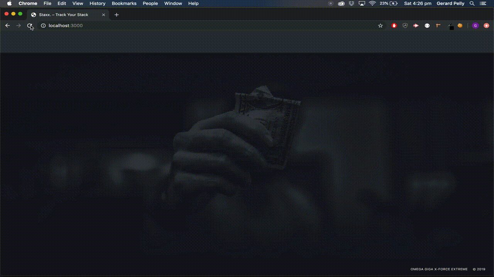

# Staxx

## Overview

Staxx is a web application that allows its users to categorically track their expenses over a chosen peroid of time. After the user has created an account they are then presented with a pop-up modal that allows them to select the chosen time period of either a week or a month and enter the amount of money they would like to allot for that chosen time period. Through the dashboard interface the user can then easily enter their transactions as they go, view all their transactions, and view a summary of their transactions as a graph.

[Staxx Github Repository](https://github.com/sjwarren91/Group-Project-2)

[Staxx on Heroku](https://shrouded-brook-64155.herokuapp.com)

# Staxx Demo

